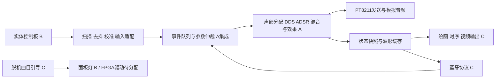

# 子系统与集成边界

以下是目标结构，当前已实现的是自动事件驱动的音频核心和PT8211输出。输入适配、仲裁、快照、通信、显示仍待实现。

## 当前代码的可复用部分

- instrument：数学音符表、正弦ROM、包络、原始voice、PT8211发送器。
- expression：8声部管理、配置握手、表情候选、meter；其接口是实际RTL接口，尚非冻结的整机协议。
- expression_baseline：复用原voice、固定音色的宽位混音器和功能演示；输入来自baseline_demo。配置部分接入但有被忽略项，见[控制接口](../interfaces/CONTROL.md)。
- audio_probe / audio_quality / audio_format：基础发声及历史诊断，保留独立顶层，不并入正常演奏模式。

## 模块之间如何解耦

物理按键编号先映射为音符事件；声部槽是内部分配结果。布局、行列扫描和音域不写死进合成器。配置需要明确单位、合法值、应答和是否实际生效；蓝牙数据帧不是HDL端口的直接字节拼接。

音频使用50MHz主域和每1040周期sample_ce；显示像素域可能来自独立PLL。状态走一致快照/握手或异步FIFO，波形走明确采样与缓存。显示允许丢旧帧、显示最新状态，绝不反压音频。多位总线逐位两级寄存器不能保证原子一致。

本地输入优先服务演奏；首版蓝牙建议只调参/状态，避免把无线时延塞进主演奏路径。两个来源同一参数写入的优先级、序号和读回需A/C在实现前约定。断连释放、队列满、重复音和持键移调要有测试。

## 资源与IP

初始不承诺分给各人固定百分比。C提交分辨率/像素时钟/ROM和波形缓存估算；B提交GPIO/ADC/通信/LED需求；A结合音频声部扩展评估总表。先为稳定整机留余量，再按实测扩展。

优先考虑有收益的Gowin PLL、ROM/RAM、FIFO、DSP、视频输出原语/IP；交付时含IP参数、工具版本、生成步骤、所需源文件和仿真依赖。不得只上传个人电脑缓存里的黑盒工程。纯RTL仿真已可用，不代表厂家原语模型已安装配置。
