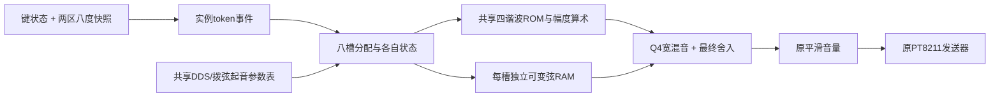

# 双区与音色选择实验

本轮执行资源共享、双区音域和干净音色三个任务。八声部、现有矩阵/旋钮/三板载键、原PT8211输出链；七个独立Designer工程便于逐个下载。**这是待用户试听的实验，已板测的 final_dual_timbre 保留。** 效果器、选择性延音、滑音和更高复音另轮处理。

先看[试听与操作](BOARD_TEST.md)，技术门槛见[SPEC](SPEC.md)，实测资源、时序和验证见[VALIDATION](VALIDATION.md)。本目录为A所有的独立候选，没有替换SYSTEM_V0、整机顶层或B/C的接口。

| 工程 | 默认发声 | 与对照相比改变什么 |
|---|---|---|
| [00_shared_reference](variants/00_shared_reference/00_shared_reference.gprj) | 原harmonic_piano | 共享ROM/算术/起音表；保留原量化和声音，用来检验资源优化 |
| [01_piano_precision](variants/01_piano_precision/01_piano_precision.gprj) | 精度钢琴 | 4096点正弦表，保留加权小数位、Q4混音和对称舍入；原谐波比例与ADSR |
| [02_piano_soft](variants/02_piano_soft/02_piano_soft.gprj) | 柔和钢琴 | 短起音、基音自然衰减、高次谐波更快衰减，减少尖亮分量 |
| [03_piano_bright](variants/03_piano_bright/03_piano_bright.gprj) | 明亮钢琴 | 增加起音高次谐波，随后自然变柔；无随机失谐 |
| [04_clean_reed](variants/04_clean_reed/04_clean_reed.gprj) | 持续簧管/Lead | 基音加较轻第三谐波，偏圆润的持续合成音；没有过载/合唱/主动颤音 |
| [05_pluck_detail](variants/05_pluck_detail/05_pluck_detail.gprj) | 拨弦细节 | 保留弦模型，去掉槽输出的9bit限幅，保留4bit混音小数后统一舍入 |
| [06_pluck_warm](variants/06_pluck_warm/06_pluck_warm.gprj) | 拨弦柔和 | 在05上增加输出端三点1:2:1平滑；没有修改弦反馈环或音高 |

每个工程的板载音色键在“该DDS候选”和“拨弦”间切换。00–04的拨弦均保持原版；05/06的DDS均为01精度钢琴。新音色只锁存到新实例，旧音和尾音不被切换重置。

## 复现

需要Gowin V1.9.12.03、ModelSim（纯RTL，原语不参与此仿真）、Python 3；WAV分析另需NumPy。七份gprj/顶层都已保存，不需要先运行生成器才能编译。通用模块通过相对路径复用 final_dual_timbre，克隆时保留仓库目录关系。

从仓库根目录运行：

```powershell
python project/audio_palette_lab/sim/run.py
python project/audio_palette_lab/tools/analyze_math.py
python project/audio_palette_lab/tools/render.py --cadence
python project/audio_palette_lab/tools/render.py --workers 3
python project/audio_palette_lab/tools/build.py --variant all
```

用`--modelsim`和`--gowin`指定本机工具目录/可执行文件。`tools/generate.py`重生数学ROM、七份gprj和薄顶层，不覆盖手写算法。`sim/audio`是本机生成的原电平和响度匹配参考；Git精选副本见[试听指南](BOARD_TEST.md)。FS均在各自`variants/<名称>/impl/pnr/<名称>.fs`，不提交Git。

## 可以带进主工程的部分



- `palette_keys`：参数化键数/分区；事件入队时锁定两个base和音色，保留原token松键。板测用16键白键缩略，完整25输入（含24个半音和顶端C）已数字验证。
- `palette_bank`：8槽统一分配，共享只读起音参数；满槽拒绝新音，已有音不会按活跃数量衰减。新的固定计算窗口最多104拍完成混音，适配握手要尊重ready。
- `palette_shared_tone`：按帧快照逐槽查表/乘幅度；各槽相位、频率、包络仍独立；N=1/16仅验证调度参数化，不等于16声部整机验收。
- `palette_slot`/`palette_pluck`：保留独立弦状态；起音参数在start锁存，查表不再每槽复制。可变延迟线不能这样共用地址覆盖。
- 新混音接口是20bit有符号Q4；旧16bit模块不能直接无移位接入。bank输出仍是16bitPCM，Fs不变，后级gain/发送器复用原模块。

更高复音应继续按后续方案分离DDS池与拨弦池。当前每个分配槽仍有一条独立弦模型，直接把N翻倍会同时复制其DSP/RAM；本轮的16槽调度测试不能作为直接扩大整机N的资源许可。

## IP与资源决策

本轮采用Gowin综合可推断的同步ROM和双口RAM，PnR已证明映射到了BSRAM。原来的重复只读表由调度共享，资源下降来自结构变化；没有为包装名义新建IP核。后续若需要固定ROM端口/初始化格式或显式DSP流水，可以包装这组已验证模块，或换官方ROM/DSP原语并做等价回归。

本轮没有整套移植第三方乐器项目。拨弦复用仓库已有Karplus–Strong RTL，钢琴/簧管为数学加法合成；波表是单周期数学正弦，不是音符录音。先前STK/Rings/OPL3研究仍见[后续方案](../../docs/project/AUDIO_NEXT_PLAN_2026-09-26.md)，未把未移植代码写成已集成。
